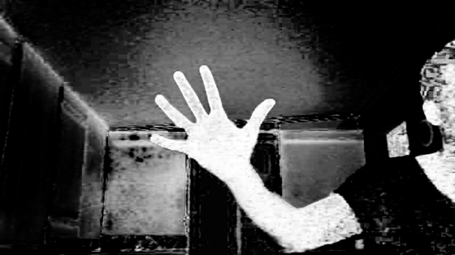
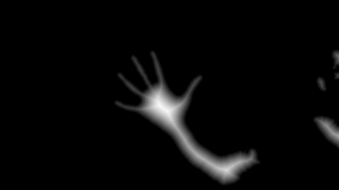
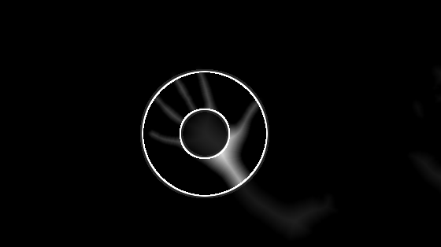
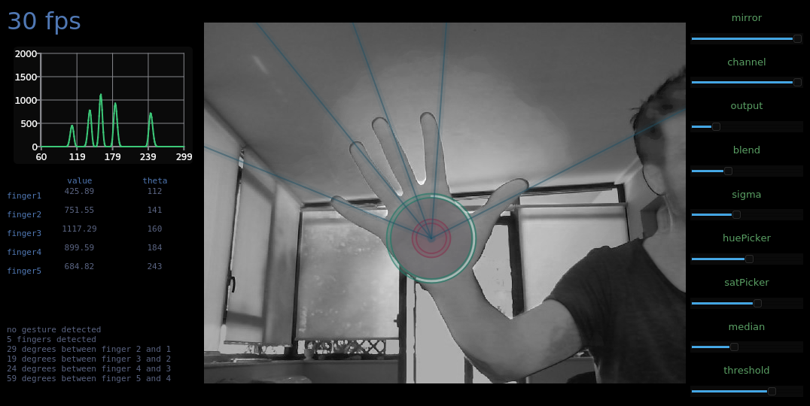

# handDetection
Hand/gesture detection with OpenCV and Qt.

## skin segmentation
A RGB to HSV color-space conversion is applied to the input frame. **Hue** and **Saturation** only are relevant for the segmentation process as **Value** it's too dependent on lighting conditions.
In a Hue/Saturation representation, each pixel has a position on a 2D plane:

If a reference skin tone is set on the plane, each pixel in the input frame can be represented by its euclidean distance from the reference point. A non-linear function (gaussian kernel) is applied to the computed distance for each pixel:

A median filter and binary thresolding conlcude the segmentation step:

## distance transform
"A distance transform is a derived representation of a digital image which labels each pixel of the image with the distance to the nearest obstacle pixel ... A most common type of obstacle pixel is a boundary pixel in a binary image." (wiki)

Applying the distance transform on the binary image results in a new image where **each skin pixel will be replaced by its distance from the nearest non-skin pixel** (meaning that higher values are assigned to the center of the hand).

## fingers detection
The pixel with the higher distance transform value is set as the center of the hand, and its value is used to determine the radius of the hand's palm inscribed circle (i.e. the largest circle contained in it). Fingers start at the boundary of this circle. Fingers region is bounded to another circle with the same center and 3x radius.

The final step adds up the distance transform values for each direction looking from the hand's center (within the outer circle region). Sums for each direction (0 to 360 degrees) are stored in an histogram. Peaks in the histogram are detected as fingers (picture below, top left).

## gesture detection

Basic gesture detection is achieved by counting the number of peaks in the histogram and the distance between them. A gesture is detected when these values match with an entry in a reference gestures library.

## QT implementation and threads
Main QT thread takes care of the graphics and UI, while the computer vision workload is run in a separate processing thread. QT signals and slots are used for inter-thread communication:
1. the image processing thread takes care of capturing webcam frames and do the CV processing
2. when computation on a frame is completed, a signal is emitted to the GUI thread carrying a reference to the output from the processing performed. Next frame processing is started
3. the GUI thread takes care of updating the graphic output and handling the user interaction (buttons, sliders, etc..)

# build
Builds with Qt 5.9.1 and OpenCV 3.3.0-2

Make sure openCV path in handDetection.pro is correct, then build with 

        qmake handProject.pro
        make

---

### runtime slider settings
| Sliders | Are |
| :--- | :--- |
| **mirror** | set to 1 to flip the image horizzontally |
| **channel** | output channel (HSV) selector |
| **output** | output modes selector - see list below |
| **blend** | blends the processed image with the original|
| **sigma** | sigma of the gaussian activation function |
| **huePicker** | sets hue level of the reference skin tone |
| **satPicker** | sets saturation level of the reference skin tone |
| **median**  | median filter kerlen size |
| **threshold** | binary thresholding level |

### ouptut modes
0. Original image (single channel, selected through channel slider)
1. Hue distance from the reference skin tone
2. Saturaion distance from the reference skin ton
3. Post gaussian activation and median filtering
4. Binary image
4. Distance transform
5. Distance transform (fingers region only)
6. Split screen

---
